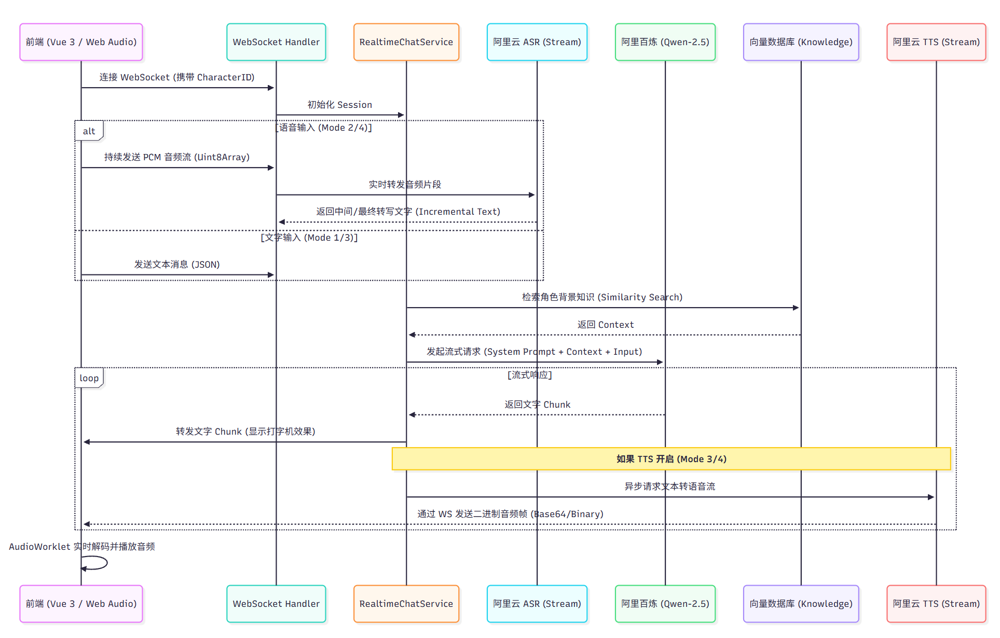

## 魂语计划 (SoulEchoPlan) 作品说明文档

### 1. 用户画像与核心痛点分析

本应用旨在打破虚拟与现实的边界，为用户提供沉浸式的跨时空对话体验。

* **目标用户类型：**
* **幻想世界的探索者：** 对特定文学、影视、历史角色有深厚情感的爱好者（如 Potterhead、历史迷）。
* **孤独倾诉者：** 需要一个 24/7 在线、无压力、不带偏见的倾听者和树洞。
* **知识求索者：** 希望以对话形式向“苏格拉底”请教哲学，或与“马斯克”探讨科技前沿的学习者。

* **用户痛点：**
* **交互单向性：** 传统的角色扮演仅限于文字阅读，缺乏“面对面”的听觉反馈。
* **社交压力：** 在现实社交中担心被评价或隐私泄露。
* **知识获取枯燥：** 传统的阅读模式互动性差，难以通过“辩论”或“追问”深化理解。

* **用户故事 (User Story)：**
> "作为一名《三体》书迷，我希望能和'罗辑'进行一次语音通话。当我向他表达对黑暗森林法则的恐惧时，他能用冷静而富有磁性的声音宽慰我，并分享他在执剑人岁月的思考，让我彻底沉浸在那个宏大的科幻世界中。"

### 2. 系统流程概览

为了让您更好地理解本应用的工作机制,下面提供两张流程图,分别从**开发者视角**和**用户视角**展示系统的运作逻辑。

#### 2.1. 开发者视角的架构逻辑流

下图展示了系统各模块之间的交互关系与数据流向:

**核心要点:**
- 前端采用 Vue3 + WebSocket 实现实时音视频流传输
- 后端基于 Spring Boot 构建高并发服务,编排 ASR→LLM→TTS 的完整链路
- AI 能力层集成阿里云服务,实现低延迟的语音识别、大模型对话与语音合成
- 数据持久层使用 MySQL 存储角色定义与会话记录

#### 2.2. 用户视角的操作流程

下图展示了用户从选择角色到完成对话的完整操作步骤:

**体验亮点:**
- **一键启动**: 选择角色后点击"开始对话"即可建立 WebSocket 长连接
- **实时响应**: 麦克风采集的音频流实时上传,ASR 识别延迟低于 200ms
- **流畅播放**: TTS 合成的音频通过流式推送,前端实现近乎零等待的平滑播放
- **沉浸体验**: 完整的语音交互链路让用户感受到与 AI 角色的"面对面"交流

### 3. 功能规划与优先级 (MoSCoW)

* **P0 (核心功能)：**
* **实时语音流式交互：** 采用 WebSocket 实现 ASR -> LLM -> TTS 的极低延迟全链路。
* **角色 CRUD 管理：** 允许用户自定义 AI 角色的名字、性格设定（Persona）。
* **多模态输入/输出切换：** 支持文字/语音输入及 TTS 开关的四种组合模式。

* **P1 (重要功能)：**
* **RAG 知识库整合：** 允许角色上传特定文档（如小说全集），使回答具备事实依据。
* **对话上下文记忆：** 基于 Redis 缓存的短期会话记忆与数据库持久化的长期背景。

* **P2 (待开发)：** 社区角色分享、多模态互动（图片生成）、高级情绪表达系统，音色自定义微调。

### 4. 技术选型与理由

本系统拒绝使用黑盒 Agent 封装，采用原子级能力组合以获得最高的定制化空间：

| 模块 | 选型 | 理由 |
| --- | --- | --- |
| **LLM** | **阿里百炼 (Qwen-2.5-Plus)** | Qwen 系列在中文语境和角色扮演能力（DITTO 训练法）上处于国际领先地位，API 响应速度快，支持长上下文。 |
| **ASR/TTS** | **阿里云智能语音交互（流式版）** | 支持实时流式识别，能够实现“边说边转文字”，延迟通常低于 200ms，且对口语化表达优化极佳；采用神经网络合成技术，提供丰富的拟人化音色。其流式二进制输出配合 WebSocket 可实现近乎零等待的语音播放。 |
| **后端框架** | **Spring Boot 3 + WebSocket** | 利用 Java 的强类型安全与异步编程（CompletableFuture）处理高并发下的长连接流式音频。 |
| **前端框架** | **Vue 3 + Pinia + Vite** | 实现组件化开发，利用 Web Audio API 处理音频的采集、裁剪与流式播放。 |

### 5. AI 角色扩展技能实现

除了基础聊天外，本项目实现了以下三个核心 AI 技能：

1. **RAG 知识内化：**
集成阿里云向量检索服务。当角色被赋予知识库（如“哈利波特”）后，AI 在生成回答前会先检索向量库，确保回答符合原著设定，而非单纯的 LLM 幻觉。
2. **多模态切换逻辑：**
系统支持根据 TTS 开关动态调整 LLM 的回复策略。例如 TTS 开启时，LLM 会被要求输出更口语化的语句。
3. **音频缓冲流式播放：**
前端配合 AudioWorklet 处理后端推送的二进制 PCM 帧，实现不间断的平滑语音输出
