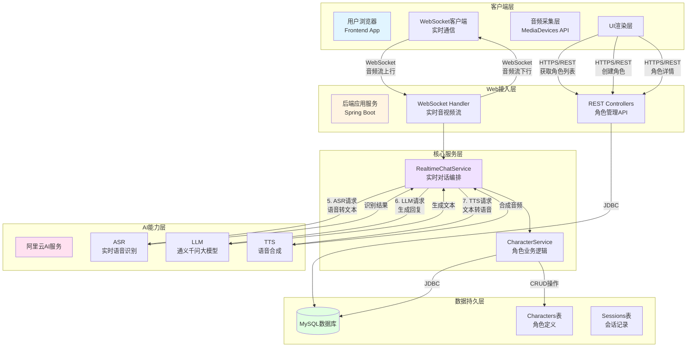

# 架构设计文档 

## 1. 项目概述 

### 1.1. 项目目标 

本项目旨在开发一个高性能、可扩展的网页应用，为用户提供与 AI 驱动的虚拟角色进行实时语音和文本对话的沉浸式体验。用户能够搜索、选择预设的知名角色，或自定义并创建私有角色进行互动。

### 1.2. 核心功能 

* **实时语音对话**：支持低延迟的流式语音识别 (ASR) 和语音合成 (TTS)，实现自然流畅的语音交流。
* **多模态交互**：同时支持文本与语音两种输入输出方式。
* **角色系统**：内置多个经典角色，并支持用户自定义角色的创建、管理与分享。
* **上下文记忆**：AI 角色具备短期会话记忆，能够理解并回应连续的多轮对话。
* **知识库增强 (RAG)**：为特定角色集成外部知识库，使其回答更加精准、符合其世界观设定。

### 1.3. 设计原则 

* **实时优先 (Real-time First)**: 系统的首要目标是保障语音交互的低延迟，所有技术选型与流程设计均以此为最高优先级。
* **MVP 驱动 (MVP-Driven)**: 优先实现核心的语音对话链路，快速构建最小可行产品，后续功能在此基础上迭代，确保项目在限定周期内可交付。
* **模块化设计 (Modular Design)**: 各功能模块（如语音处理、AI 能力、角色管理）应保持高内聚、低耦合，便于独立开发、测试与维护。
* **云原生亲和 (Cloud-Native Friendly)**: 整体架构采用容器化方案，便于在不同环境中快速部署、迁移和扩展。

## 2. 系统架构设计

本系统采用前后端分离的现代化架构，通过 API 网关与云服务进行解耦，确保系统的高内聚、低耦合与可扩展性。

### 2.1. 整体架构图 



### 2.2. 核心流程说明

* **HTTP/S 请求**：前端通过 RESTful API 向后端发起非实时性请求，如获取角色列表、创建自定义角色等。
* **WebSocket 连接**：用户进入对话页面后，前端与后端 WebSocket 网关建立长连接，用于传输实时音频数据和控制信令 。
* **数据持久化**：后端服务将角色定义、会话元数据等存入关系型数据库。
* **云服务调用**：AI 核心逻辑由后端服务编排，通过 SDK 调用阿里云的 ASR, LLM, TTS 及向量数据库服务，完成 AI 计算任务。

### 2.3. 开发者视角的架构逻辑流

下图从开发者的角度展示了系统各模块之间的交互逻辑与数据流向:


**图解说明:**
- **蓝色区域**: 前端浏览器层,负责用户交互与媒体流处理
- **黄色区域**: 后端服务层,包含 Web 接入、核心业务逻辑与数据持久化
- **粉色区域**: AI 能力层,集成阿里云的 ASR、LLM、TTS 服务
- **绿色区域**: 数据持久层,存储角色定义与会话记录

## 3. 核心模块详述 

### 3.1. 前端模块 

**技术栈**：HTML5, CSS3, JavaScript, Vue3, WebSocket API 

**核心职责**： 

* **UI 渲染**：负责所有用户界面的展示与交互 。
* **媒体流处理**：调用浏览器 MediaDevices (getUserMedia) API 获取麦克风音频流，并使用 MediaRecorder API 将其切片为适合网络传输的数据块。
* **实时通信**：通过 WebSocket 客户端，将音频数据流式上传至后端，并接收后端返回的音频流进行实时播放。
* **状态管理**：维护会话状态，如连接状态、当前角色信息等。

### 3.2. 后端模块 

**技术栈**：Java, Spring Boot 

#### 3.2.1. Web 

**职责描述**: 作为系统的流量入口，负责协议处理与请求分发 。

* **RESTful API**: 提供角色管理的 HTTP 接口。
    * `GET /api/characters`: 获取公开角色列表。
    * `GET /api/characters/{id}`: 获取指定角色详情。
    * `POST /api/characters`: 创建新角色。
* **WebSocket Handler**: 负责处理 WebSocket 连接 (/ws/chat/{characterId}), 管理用户会话生命周期，并处理双向的实时数据流 。

#### 3.2.2. 核心服务层 6

**职责描述**: 实现应用的核心业务逻辑 。

* **RealtimeChatService**: 业务核心 。负责编排完整的语音对话流程：接收前端音频流 -\> 调用 ASR/LLM/TTS -\> 将合成音频流推回前端 。同时，在此模块内实现会话级的上下文记忆管理（Chat Memory） 。
* **CharacterService**: 负责角色的业务逻辑，处理前端的增删改查请求，并与数据持久化。

#### 3.2.3. AI 能力集成层 (AI Capability Integration Layer) 

**职责描述**: 封装对第三方 AI 服务的调用，对上层服务提供统一、简洁的接口。

* **ASRClient**: 对接阿里云实时语音识别服务 SDK。
* **LLMClient**: 对接阿里云通义千问模型 API 。负责 Prompt 构造（拼接角色设定、对话历史和当前用户输入） 。
* **TTSClient**: 对接阿里云语音合成服务 SDK 。

#### 3.2.4. 数据持久化层 (Data Persistence Layer) 

**职责描述**: 负责与数据库交互，进行数据的持久化存储和读取。

* **ORM 框架**: 采用 JPA (Hibernate) 或 MyBatis 进行数据库操作 。
* **数据模型**: 见下方 "3.3. 数据模型设计" 。

### 3.3. 数据模

* **技术选型**：关系型数据库 ( MySQL) + ORM 框架 (JPA) 。
* **部署方式**：使用 Docker 容器化部署，便于环境隔离与迁移。
* **核心数据模型**：

<!-- end list -->

```sql
-- 角色定义表
CREATE TABLE characters (
  id BIGINT PRIMARY KEY AUTO_INCREMENT,
  name VARCHAR(255) NOT NULL UNIQUE,          -- 角色名称 
  description TEXT,                            -- 角色背景描述 
  persona_prompt TEXT NOT NULL,                -- 核心人设 Prompt (用于LLM) 
  avatar_url VARCHAR(1024),                    -- 角色头像URL 
  voice_id VARCHAR(255),                       -- TTS 语音音色ID 
  is_public BOOLEAN DEFAULT TRUE,              -- 是否为公开角色 
  created_at TIMESTAMP NOT NULL DEFAULT CURRENT_TIMESTAMP, 
  updated_at TIMESTAMP NOT NULL DEFAULT CURRENT_TIMESTAMP ON UPDATE CURRENT_TIMESTAMP 
);
```

## 4. 技术栈选型

| 领域 | 技术/服务 | 选用理由 |
| --- | --- | --- |
| 前端 | "HTML5, CSS3, JavaScript, Vue.js" | 提供丰富的用户交互和强大的媒体处理能力。 |
| 后端 | "Java 17+, Spring Boot 3+" | 业界主流，生态成熟，性能稳定。 |
| 数据库 | MySQL | 开源、稳定，满足当前业务需求。 |
| 数据访问 | Spring Data JPA | 简化数据库操作，提高开发效率。 |
| 实时通信 | WebSocket | 实现服务器与客户端全双工通信，是语音流传输的基础。 |
| AI 服务 | "阿里云 (ASR, TTS, LLM, 向量检索服务)" | 统一云厂商可最大化降低服务间网络调用延迟。 |
| 部署 | Docker | 实现环境标准化与快速部署。 |


## 5. 关键流程实现

### 5.1. 核心流程分析

为实现最低延迟，所有环节。

1.  **用户操作**: 用户在前端页面选择一个角色，点击“开始对话”按钮。
2.  **连接建立**: 前端通过 WebSocket 连接到后端的 /ws/chat/{characterId} 地址 。
3.  **音频捕获**: 连接成功后，前端开始捕获麦克风的 PCM 音频流 。
4.  **音频流上行**: 前端将捕获的音频数据块通过 WebSocket 实时发送至后端。
5.  **语音转文本 (ASR)**: 后端 RealtimeChatService 接收音频流，并将其转发给 ASRClient 调用阿里云 ASR 服务，获取实时识别的文本结果。
6.  **语言模型处理 (LLM)**: 服务获取 ASR 结果后，结合角色设定 (persona\_prompt) 和当前会话的上下文历史，构造完整的 Prompt，通过 LLMClient 调用通义千问模型。
7.  **文本转语音 (TTS)**: 服务获取 LLM 生成的文本应答，通过 TTSClient 调用阿里云 TTS 服务，将其合成为音频流 。
8.  **音频流下行**: 后端将 TTS 生成的音频数据块通过 WebSocket 实时推送回前端。
9.  **音频播放**: 前端接收到音频流后，立即进行缓冲和播放，用户听到 AI 角色的回应。

### 5.2. 用户操作流程图

下图从用户的视角展示了从选择角色到完成对话的完整操作流程:


**流程要点:**
- **步骤1-2**: 用户在浏览器中选择角色并建立 WebSocket 连接
- **步骤3-4**: 浏览器采集麦克风音频并实时上传至后端
- **步骤5-7**: 后端依次调用 ASR、LLM、TTS 服务处理音频与文本
- **步骤8-9**: 合成后的语音流实时推送回前端进行播放,实现低延迟对话

### 5.3. 知识库增强 (RAG)

该流程旨在让角色的回答更具事实性和深度。

* **离线处理（数据准备）**： 
    * 收集特定角色的背景资料、原著文本等 。
    * 将文本进行切片（Chunking）。
    * 调用 Embedding 模型将文本片段向量化。
    * 将向量及原文存入阿里云向量数据库。
* **在线处理（实时检索）**： 
    * 当用户提问时，后端首先将用户的问题文本进行向量化。
    * 使用该向量在向量数据库中进行相似度检索，召回 Top-K 个最相关的知识片段。
    * 将这些知识片段作为上下文，与角色设定、聊天历史、用户问题一起，构建最终的。
    * 将构建好的 Prompt 发送给 LLM，生成最终回答。

